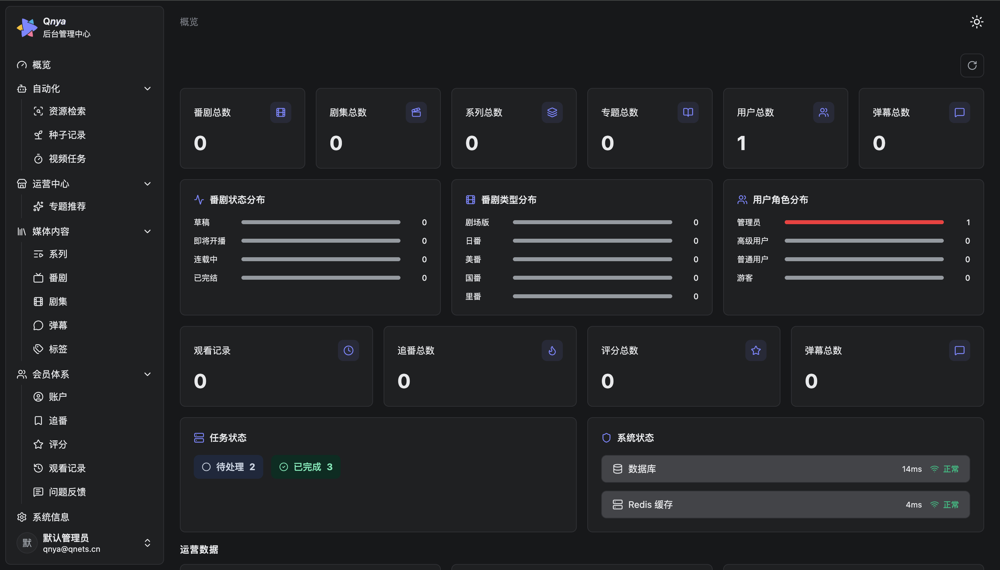
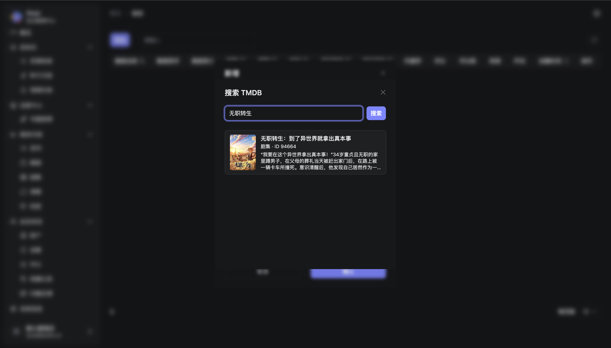

# Qnya Backend

Qnya 番剧平台管理后台，仅限 `admin` 角色访问，支持移动端自适应。

## 预览





## 功能模块

### 概览 `/`

数据看板：内容统计卡片、互动数据、番剧/用户分布图表、任务状态、系统健康（DB + Redis 延迟）、追番排行 Top 10、最新反馈与评分。有未处理反馈时顶部显示告警。

### 自动化

| 路径         | 说明                           |
| ------------ | ------------------------------ |
| `/resources` | 外部番剧资源检索与关联         |
| `/torrents`  | 种子记录管理，对接 qBittorrent |
| `/tasks`     | 视频任务队列，支持手动入库     |

### 运营中心

| 路径      | 说明             |
| --------- | ---------------- |
| `/topics` | 首页专题推荐配置 |

### 媒体内容

| 路径      | 说明                                                                        |
| --------- | --------------------------------------------------------------------------- |
| `/series` | 番剧系列管理                                                                |
| `/anime`  | 番剧 CRUD，支持 TMDB 搜索填充元数据，按类型 / 状态 / 年份 / 季度 / 标签过滤 |
| `/videos` | 剧集管理                                                                    |
| `/dans`   | 弹幕记录管理                                                                |
| `/tags`   | 标签管理                                                                    |

番剧枚举值：

| 字段 | 可选值                         |
| ---- | ------------------------------ |
| 类型 | 日番、国番、美番、剧场版、里番 |
| 状态 | 草稿、即将开播、连载中、已完结 |
| 季度 | 一月番、四月番、七月番、十月番 |

### 会员体系

| 路径         | 说明                                           |
| ------------ | ---------------------------------------------- |
| `/users`     | 账户管理，角色：admin / premium / user / guest |
| `/favorites` | 追番记录                                       |
| `/scores`    | 评分记录（10 分制）                            |
| `/histories` | 观看历史                                       |
| `/feedbacks` | 问题反馈处理                                   |

### 系统信息 `/settings`

展示后端运行配置：服务器、qBittorrent、SMTP、数据库连接池、Session、安全配置、资源路径、TMDB。支持手动清除仪表盘缓存。

### MCP `/mcp`

展示 MCP（Model Context Protocol）集成信息：端点地址、Token 鉴权状态（未启用时显示警告）、可用工具列表（工具卡片网格）、Markdown 渲染的完整操作指南。

## 技术栈

| 类别     | 技术                                             |
| -------- | ------------------------------------------------ |
| 框架     | React 19 + TypeScript                            |
| 构建     | Vite 8 + React Compiler                          |
| 路由     | React Router DOM v7（路由级懒加载）              |
| 状态管理 | Zustand v5 + Immer                               |
| UI       | Radix UI + Tailwind CSS v4 + shadcn/ui           |
| 表格     | TanStack Table v8（排序、过滤、分页、虚拟滚动）  |
| 表单     | React Hook Form v7 + Zod v4                      |
| 请求     | Axios + ahooks `useRequest`                      |
| Markdown | react-markdown v10 + remark-gfm                  |
| 规范     | ESLint + Prettier + husky + Conventional Commits |

## 项目结构

```
src/
├── apis/          # 接口定义
├── components/
│   ├── custom/    # 业务组件（auth、data-table、form、sidebar）
│   └── ui/        # shadcn/ui 基础组件
├── hooks/         # 通用 hooks
├── lib/           # 工具函数、请求封装
├── pages/         # 页面（columns / row-actions / form 分离）
├── store/         # Zustand store（按模块 + 共享 base slice）
└── routes.tsx     # 路由配置
```

## 开发

```bash
# 1. 配置 hosts（配合后端 Cookie domain）
echo "127.0.0.1 localhost.qnya.cn" | sudo tee -a /etc/hosts

# 2. 安装依赖
pnpm install

# 3. 启动开发服务器（http://localhost.qnya.cn:5900，/api 代理到 :3000）
pnpm dev

# 构建
pnpm build

# 打包体积分析
pnpm analyze

# 代码检查
pnpm lint
```

提交信息遵循 [Conventional Commits](https://www.conventionalcommits.org/) 规范，提交时自动执行 lint-staged。

## MCP 接入指南

Qnya 后端暴露了一个 [MCP（Model Context Protocol）](https://modelcontextprotocol.io/) 端点，可将平台数据工具直接接入 Claude、Cursor 等支持 MCP 的 AI 客户端。

### 第一步：获取接入信息

在管理后台进入 **MCP** 页面（`/mcp`），可以查到：

- **端点地址**：形如 `https://your-domain.com/api/mcp`
- **Token 保护**：显示"已启用"时需要在请求头携带 Bearer Token；显示"未启用"（黄色警告）时无需鉴权
- **可用工具列表**：当前服务端注册的所有工具名称与说明

Token 由后端管理员签发，请向服务端管理员获取。

### 第二步：配置客户端

将下方示例中的 `YOUR_ENDPOINT` 替换为实际端点地址，`YOUR_TOKEN` 替换为实际 Token。若 Token 保护未启用，去掉 `headers` 字段即可。

#### Claude Desktop

编辑 `~/Library/Application Support/Claude/claude_desktop_config.json`（Windows 为 `%APPDATA%\Claude\claude_desktop_config.json`）：

```json
{
  "mcpServers": {
    "qnya": {
      "url": "YOUR_ENDPOINT",
      "headers": {
        "Authorization": "Bearer YOUR_TOKEN"
      }
    }
  }
}
```

保存后重启 Claude Desktop 生效。

#### Cursor

编辑 `~/.cursor/mcp.json`（或项目根目录下的 `.cursor/mcp.json`）：

```json
{
  "mcpServers": {
    "qnya": {
      "url": "YOUR_ENDPOINT",
      "headers": {
        "Authorization": "Bearer YOUR_TOKEN"
      }
    }
  }
}
```

#### Claude Code

```bash
claude mcp add --transport http qnya YOUR_ENDPOINT \
  --header "Authorization: Bearer YOUR_TOKEN"
```

验证是否接入成功：

```bash
claude mcp list
```

### 备注

- MCP 端点采用 **Streamable HTTP** 传输协议，无需额外安装本地进程
- 可用工具的完整说明见管理后台 `/mcp` 页面的「操作指南」区块
